  
  
    

  

  

<pre>
+-[ sobre ]-------------------------------------------------
|
| Breves Preces De Um Trilhao de Anjos
| 
| vo colocar umas coisa ainda
|
+-----------------------------------------------------------
</pre>

<pre>
+-[ stack ]-------------------------------------------------
|
| [ robótica ]  [ hardware ]  [ programação ]
| [ modelagem 3d ]
|
+-----------------------------------------------------------
</pre>

<pre>
+-[ projetos ]----------------------------------------------
|
| site etemar   (vercel)        -> <a href="https://site-etemar.vercel.app/">ver projeto</a>
| the v0id      (github pages)  -> <a href="https://blackpedrohenrique84-maker.github.io/thev0id.github.io/">ver projeto</a>
|
+-----------------------------------------------------------
</pre>

<pre>
+-[ dados do sistema ]--------------------------------------
|
</pre>

  

<pre>
+-[ contato ]-----------------------------------------------
|
| instagram ..... <a href="https://www.instagram.com/__thehakur0o/">@__thehakur0o</a>
| discord ....... v0idguyy
| github ........ <a href="https://github.com/blackpedrohenrique84-maker">blackpedrohenrique84-maker</a>
|
+-----------------------------------------------------------
</pre>

  <code>sys.exit(0) // mantido por Pedro Henrique Alves de Lima</code>

